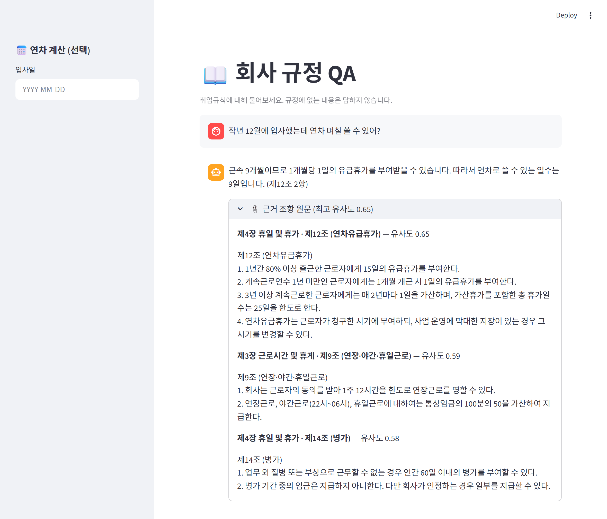
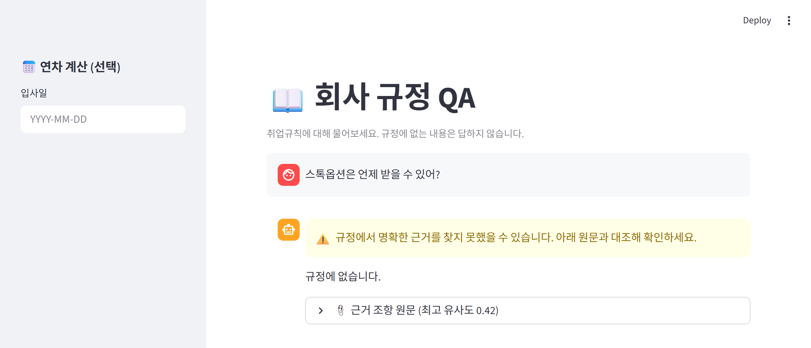
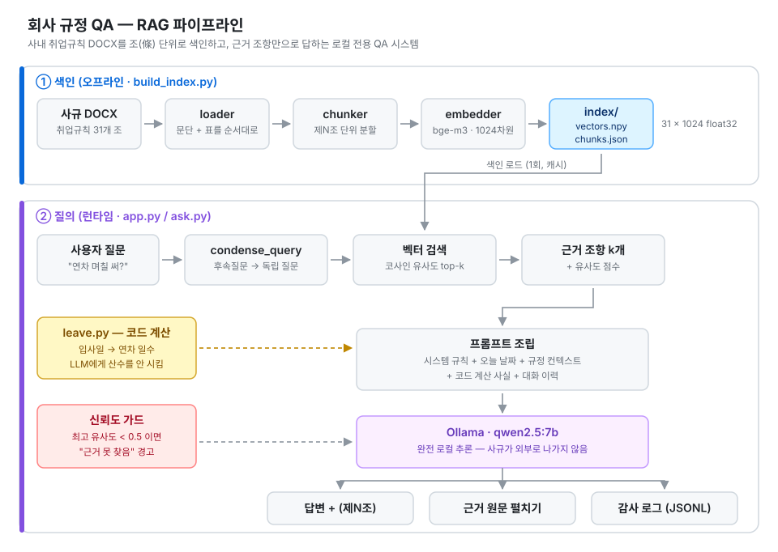
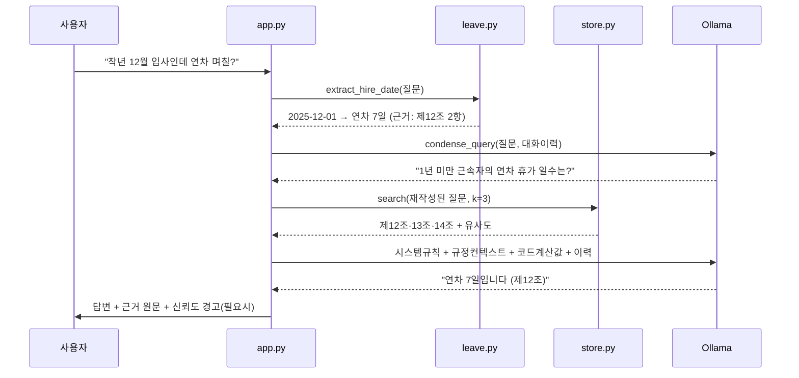

# 📖 회사 규정 QA — Company Policy RAG

사내 취업규칙(사규)을 **근거 조항으로만** 답하는 로컬 전용 RAG 챗봇입니다.
"그럴듯한 답"이 아니라 **"제N조에 이렇게 쓰여 있다"** 를 내놓는 것을 목표로, 할루시네이션 억제 장치를 코드 레벨에서 구현했습니다.

## 실행 화면

**① 근거 조항으로 답한다**

문장에서 입사일을 뽑아내고(`작년 12월` → `2025-12-01`), 연차 일수는 **코드가** 계산합니다.
LLM은 그 숫자를 그대로 쓰고 `(제12조 2항)`으로 출처를 답니다. 아래에는 검색된 조항 원문이 유사도와 함께 펼쳐집니다.



**② 규정에 없으면 답하지 않는다**

최고 유사도가 임계값(0.5)에 못 미치면 경고를 띄우고, 모델은 `규정에 없습니다`로 답합니다.
그럴듯한 말을 지어내는 대신 모른다고 말하게 하는 것이 이 프로젝트의 목표입니다.



---

## 아키텍처

<p align="center">
  
</p>

---

## 왜 이렇게 만들었나

사규 QA는 일반 챗봇과 요구사항이 다릅니다.

| 일반 챗봇 | 사규 QA |
|---|---|
| 그럴듯하면 OK | 틀리면 노무 분쟁으로 직결 |
| 답변 자체가 결과물 | **근거 조항**이 있어야 결과물 |
| 외부 API 사용 자유 | 사내 문서를 외부로 보낼 수 없음 |

그래서 "정확도"보다 **검증 가능성(verifiability)** 과 **로컬 실행**을 우선하는 구조로 설계했습니다.
사용자가 답을 못 믿겠으면 **바로 아래 펼쳐진 원문 조항**과 대조할 수 있어야 한다는 게 핵심 전제입니다.

---

## 핵심 설계 결정

### 1. LLM에게 산수를 시키지 않는다

연차 일수 계산은 LLM이 가장 자주 틀리는 지점입니다. 그래서 **계산을 코드로 빼고, LLM에는 결과만 주입**합니다.

```python
# src/leave.py — 제12조 규칙을 코드로 구현
if years < 1:
    days = months                      # 1년 미만: 개근 1개월당 1일 (2항)
else:
    extra = (years - 1) // 2           # 3년 이상 매 2년 +1일 (3항)
    days  = min(15 + extra, 25)        # 25일 한도
```

계산된 값은 이런 형태로 프롬프트에 들어갑니다.

```
[코드 계산 결과 — 이 숫자를 정답으로 사용하고 다시 계산하지 마라]
입사일 2025-12-01 기준, 근속 7개월(1년 미만) → 1개월당 1일, 연차 7일.
```

입사일은 사이드바 입력뿐 아니라 **채팅 문장에서도 정규식으로 추출**합니다 (`"작년 12월에 입사했는데 연차 며칠?"` → `2025-12-01`).

시스템 프롬프트는 주입된 값을 **다시 계산하지 말고 그대로 쓰라고** 못박고, `temperature=0`으로 호출합니다.
규정 QA는 같은 질문에 늘 같은 답이 나와야 하므로 샘플링을 끄는 편이 맞습니다.

### 2. 조(條) 단위 청킹 — 고정 길이 분할을 쓰지 않음

법령/사규는 `제N조 (제목)` 이라는 **명시적 의미 경계**를 가집니다.
고정 길이(예: 512자)로 자르면 한 조항이 두 청크로 쪼개져 근거 표기가 불가능해집니다.

```python
ARTICLE_RE = re.compile(r"^제(\d+)조\s*\((.+?)\)")   # 제12조 (연차유급휴가)
CHAPTER_RE = re.compile(r"^(제\d+장.*|부칙)")         # 제4장 휴일 및 휴가
```

결과적으로 각 청크는 `article_no` / `article_title` / `chapter` 메타데이터를 갖게 되고,
답변에 **`(제12조)` 형태로 출처를 정확히 붙일 수 있습니다.**

> 샘플 문서 기준 **10개 장, 31개 조항** → 31 × 1024차원 벡터로 색인

### 3. 신뢰도 가드 + 감사 로그

RAG의 실패는 "검색이 엉뚱한 걸 물어왔는데 LLM이 자신 있게 답하는 것"입니다. 두 겹으로 막았습니다.

- **신뢰도 가드** — 최고 코사인 유사도가 `0.5` 미만이면 답변 위에 경고 배너를 띄우고, 근거 원문을 강제로 노출합니다.
- **감사 로그** — 모든 Q&A를 JSONL로 남깁니다. 사후에 "언제 누가 뭘 물었고 어떤 조항을 근거로 답했는지" 추적 가능합니다.

```json
{"ts":"2026-07-08T14:22:10","question":"연차 며칠 쓸 수 있어?",
 "top_article":12,"top_score":0.712,"cited":[12,13,14],
 "computed_fact":"입사일 2025-12-01 기준, ... 연차 7일."}
```

### 4. 완전 로컬 — 외부 API 호출 0회

임베딩(`BAAI/bge-m3`)과 생성(`qwen2.5:7b` via Ollama) 모두 로컬에서 돕니다.
사규 원문도, 직원 질문도 네트워크를 벗어나지 않습니다.

---

## 질의 흐름



**후속질문 처리**: `"그럼 3년차는?"` 같은 대명사 질문은 그대로 검색하면 실패합니다.
`condense_query()` 가 대화 이력을 보고 `"3년차 근로자의 연차 휴가 일수는?"` 으로 재작성한 뒤 검색합니다.
(원 질문은 히스토리에 그대로 저장해 대화의 자연스러움은 유지)

---

## 프로젝트 구조

```
company_rag/
├── app.py              # Streamlit 웹 UI (신뢰도 경고 · 근거 펼치기 · 연차 사이드바)
├── ask.py              # CLI 챗봇
├── build_index.py      # 색인 생성 파이프라인
├── requirements.txt
├── data/               # 취업규칙 샘플 DOCX (v1: 문단만 / v2: 표 포함)
├── index/              # 색인 산출물 (gitignore — build_index.py 로 생성)
├── src/
│   ├── loader.py       # DOCX → 문단·표를 문서 순서대로 추출
│   ├── chunker.py      # 제N조 단위 청킹 + 장(章) 메타데이터
│   ├── embedder.py     # bge-m3 임베딩 (정규화)
│   ├── store.py        # 색인 저장/로드 + 코사인 top-k 검색
│   ├── answer.py       # 프롬프트 조립 + Ollama 호출 + 질문 재작성
│   ├── leave.py        # 연차 계산 (LLM 산수 대체) + 입사일 추출
│   └── audit.py        # 감사 로그 (JSONL)
└── tools/              # 단계별 자가 검증 스크립트 9종
```

---

## 실행 방법

### 사전 준비

```bash
# 1) Ollama 설치 후 생성 모델 받기
ollama pull qwen2.5:7b
```

```bash
# 2) 의존성 설치 (임베딩 모델은 최초 실행 시 자동 다운로드)
pip install -r company_rag/requirements.txt
```

### 색인 생성 → 실행

```bash
cd company_rag && python build_index.py
```

```bash
streamlit run app.py
```

CLI로 쓰려면:

```bash
python ask.py
```

---

## 자가 검증

각 단계를 독립적으로 채점하는 스크립트를 두어, 파이프라인 어디가 깨졌는지 바로 찾을 수 있게 했습니다.

| 스크립트 | 검증 대상 | 모델 필요 |
|---|---|:---:|
| `check_loader.py` | DOCX 문단 추출 | — |
| `check_loader_v2.py` | 표 추출 + v1 하위호환 | — |
| `check_chunker.py` | 조 단위 분할 (31개) | — |
| `check_extract.py` | 입사일 정규식 추출 | — |
| `check_leave.py` | 연차 계산 경계값 | — |
| `check_embedder.py` | 임베딩 차원·정규화 | 임베더 |
| `check_search.py` | 검색 정확도 | 임베더 |
| `check_answer.py` | 답변 사실성·출처 표기 | Ollama |
| `check_chat.py` | 질문 재작성·대화 이력 | Ollama |

```bash
python tools/check_leave.py
```

---

## 데이터

`data/` 의 취업규칙 문서는 **실제 사규가 아닌 샘플**입니다. 실 데이터는 포함하지 않았습니다.

- `사규_취업규칙_샘플.docx` — 문단으로만 구성 (10장 31조)
- `사규_취업규칙_샘플_v2.docx` — 동일 내용 + 표(table) 포함. 로더의 표 처리 검증용

---

## 알려진 제약 / 다음 단계

- **검색이 순수 벡터 top-k** — 조항 번호를 직접 묻는 질문(`"제15조가 뭐야?"`)에는 BM25 하이브리드가 더 정확합니다.
- **평가셋 부재** — 현재는 스크립트 기반 스모크 테스트 수준. 질문-정답-근거조항 셋을 만들어 recall@k / 출처 정확도를 수치화하는 게 다음 과제입니다.
- **`k=3` 고정** — 조항이 짧아 컨텍스트 여유가 있는데도 고정값을 씁니다. 유사도 임계값 기반 동적 k가 더 적절합니다.
- **개정 이력 미지원** — 사규는 개정되므로 시행일 기준 버전 관리가 필요합니다.

---

## 기술 스택

`Python` · `Streamlit` · `Ollama (qwen2.5:7b)` · `sentence-transformers (BAAI/bge-m3)` · `NumPy` · `python-docx`
