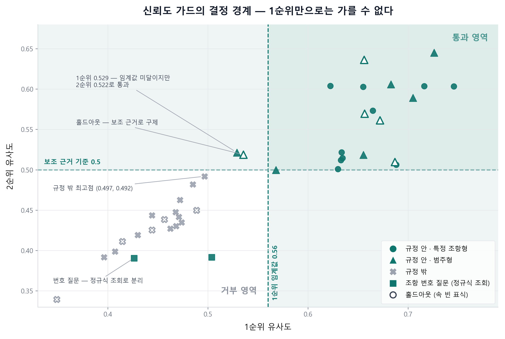

# 신뢰도 가드 평가

"근거가 없으면 답하지 않는다"가 실제로 지켜지는지, **라벨링된 질문셋으로 측정한 결과**입니다.

재현: `python tools/eval_guard.py` (임베딩 + Ollama 필요)

---

## 무엇을 재는가

기능 검증(`check_*.py`)이 "동작하는가"를 본다면, 이 평가는 **"임계값이 옳은가"**를 따집니다.
두 방향의 오류를 각각 셉니다.

| 지표 | 정의 | 위험 |
|---|---|---|
| **오거부** (false refusal) | 규정에 있는데 답을 거부 | 챗봇이 쓸모없어짐 |
| **오답변** (false answer) | 규정에 없는데 답을 지어냄 | 잘못된 규정 안내 → 노무 분쟁 |

둘 다 0이어야 "근거 있으면 답한다"와 "근거 없으면 답하지 않는다"를 **동시에** 지켰다고 말할 수 있습니다.
한쪽만 0인 건 쉽습니다 — 전부 거부하면 오답변이 0이고, 전부 답하면 오거부가 0입니다.

## 질문셋

30문항. 규정 안 18 / 규정 밖 12.

규정 안 질문은 샘플 취업규칙 31개 조항 중 **서로 다른 조항 11개**를 겨냥해 만들었고
(제3·5·9·10·12·13·14·21·23·24·27조), 조항 번호로 직접 묻는 질문 2개를 포함했습니다.
규정 밖 질문은 문서에 **전혀 등장하지 않는 복리후생 주제**로 골랐습니다.

> 경계가 모호한 주제는 의도적으로 제외했습니다. 예: "재택근무 지원금"은
> 재택근무 제도 자체가 제10조에 있어 안/밖 판정이 갈립니다.

---

## 결과

```
임계값 0.56 + 보조 근거 규칙
전체 30문항 (규정 안 18 / 규정 밖 12)

오거부(규정 안인데 거부)   0
오답변(규정 밖인데 답변)   0
근거 조항 적중           18/18
```

> **"근거 조항 적중"은 검색된 1순위 조항이 기대한 조항과 일치했다는 뜻입니다.**
> 생성된 문장의 내용이 사실로 맞는지는 이 평가의 범위가 아니며 `check_answer.py`가 따로 봅니다.

### 규정 안 (18문항) : 전부 정상 답변

| 질문 | 벡터 유사도 | 처리 경로 | 근거 |
|---|---:|---|---|
| 무단결근 며칠이면 징계 받아? | 0.746 | 강한 근거 → 생성 | 제27조 ✅ |
| 임금은 어떤 항목으로 구성돼? | 0.726 | 강한 근거 → 생성 | 제15조 ✅ |
| 육아휴직 얼마나 쓸 수 있어? | 0.716 | 강한 근거 → 생성 | 제23조 ✅ |
| 징계는 어떤 종류가 있어? | 0.705 | 강한 근거 → 생성 | 제26조 ✅ |
| 수습기간 임금은 몇 퍼센트야? | 0.688 | 강한 근거 → 생성 | 제5조 ✅ |
| 어떤 경우에 휴직할 수 있어? | 0.683 | 강한 근거 → 생성 | 제23조 ✅ |
| 결혼하면 휴가 며칠 나와? | 0.665 | 강한 근거 → 생성 | 제13조 ✅ |
| 연차 며칠 쓸 수 있어? | 0.655 | 강한 근거 → 생성 | 제12조 ✅ |
| 채용 절차가 어떻게 돼? | 0.655 | 강한 근거 → 생성 | 제4조 ✅ |
| 퇴직하려면 어떻게 해야 해? | 0.634 | 강한 근거 → 생성 | 제24조 ✅ |
| 야간근로 수당 가산율이 어떻게 돼? | 0.634 | 강한 근거 → 생성 | 제9조 ✅ |
| 겸직해도 되나요? | 0.633 | 강한 근거 → 생성 | 제21조 ✅ |
| 병가는 며칠까지 쓸 수 있어? | 0.630 | 강한 근거 → 생성 | 제14조 ✅ |
| 재택근무 신청은 며칠 전에 해야 해? | 0.622 | 강한 근거 → 생성 | 제10조 ✅ |
| 복무 중에 지켜야 할 게 뭐야? | 0.568 | 강한 근거 → 생성 | 제18조 ✅ |
| 휴가에는 어떤 종류가 있어? | 0.529 | **보조 근거** → 생성 | 제13조 ✅ |
| 제3조가 뭐야? | 0.504 | **정규식 조회** → 생성 | 제3조 ✅ |
| 제27조가 뭐야? | 0.426 | **정규식 조회** → 생성 | 제27조 ✅ |

마지막 세 줄이 **단일 임계값이었다면 거부됐을 질문**입니다.
`휴가에는 어떤 종류가 있어?`는 1순위 0.529로 임계값(0.56) 미달이지만 보조 근거로 통과했고,
번호 질문 둘은 아예 벡터 검색을 타지 않습니다.

### 규정 밖 (12문항) : 전부 거부

| 질문 | 벡터 유사도 | 처리 경로 | 결과 |
|---|---:|---|---|
| 반려동물 동반출근 가능해? | 0.497 | 근거 부족 → 거부 | 근거 없음 |
| 통근버스 운행하나요? | 0.485 | 근거 부족 → 거부 | 근거 없음 |
| 사택이나 기숙사 제공하나요? | 0.474 | 근거 부족 → 거부 | 근거 없음 |
| 주차비 지원해주나요? | 0.472 | 근거 부족 → 거부 | 근거 없음 |
| 사내 카페 할인되나요? | 0.471 | 근거 부족 → 거부 | 근거 없음 |
| 동호회 지원금 나오나요? | 0.468 | 근거 부족 → 거부 | 근거 없음 |
| 명절 선물 주나요? | 0.468 | 근거 부족 → 거부 | 근거 없음 |
| 생일에 선물 주나요? | 0.462 | 근거 부족 → 거부 | 근거 없음 |
| 사내 헬스장 이용료 얼마야? | 0.444 | 근거 부족 → 거부 | 근거 없음 |
| 자녀 학자금 지원되나요? | 0.430 | 근거 부족 → 거부 | 근거 없음 |
| 야유회 가나요? | 0.407 | 근거 부족 → 거부 | 근거 없음 |
| 스톡옵션 언제 받아? | 0.396 | 근거 부족 → 거부 | 근거 없음 |

---

## 가드 구조 — 단일 점수로는 범주형 질문을 가를 수 없다

처음에는 **1위 유사도 하나**로 판정했습니다. 그런데 `"휴가에는 어떤 종류가 있어?"` 같은
**범주형 질문**이 거부됐습니다. 여러 조항(제11~14조)에 걸쳐 있어 어느 하나와도 강하게
맞지 않아 1위가 0.529에 그치기 때문입니다. 검색이 틀린 게 아니라 질문이 넓은 겁니다.

문제는 이 점수가 **규정 밖 질문과 겹친다**는 것입니다.

```
휴가에는 어떤 종류가 있어?  (규정 안)  1위 0.529
반려동물 동반출근 가능해?   (규정 밖)  1위 0.497
                                      차이 0.032
```

임계값을 어디에 둬도 둘을 가를 수 없습니다. **단일 점수로는 풀리지 않는 문제입니다.**

### 분포의 모양은 다르다

점수 하나가 아니라 **몇 개가 모여 있는지**를 보면 깨끗하게 갈립니다.

| | 1위 | 0.5 이상인 조항 수 |
|---|---:|---:|
| 휴가에는 어떤 종류가 있어? (안) | 0.529 | **2개** (0.529, 0.522) |
| 규정 밖 12문항 **전부** | ≤0.497 | **0개** |

규정 밖 질문은 **12문항 모두** 0.5를 넘는 조항이 하나도 없었습니다.
반면 범주형 질문은 1위가 낮아도 0.5대가 여러 개 모입니다.

### 그래서 복합 규칙으로

```python
# src/answer.py — judge_evidence()
passed = (top1 >= CONF_THRESHOLD)          # 강한 근거 1개 (0.56)
      or (support >= MIN_SUPPORT)          # 또는 보조 근거 2개 (0.50 이상)
```

"강한 근거 하나" **또는** "보조 근거 둘" 중 하나면 통과시킵니다.
단일 점수만 보는 규칙보다 **우연한 단일 오탐에 강합니다** — 규정 밖 질문이 어쩌다
한 조항과 0.54로 맞아도, 두 번째 근거가 없으면 여전히 거부됩니다.

| 통과 경로 | 30문항 중 |
|---|---:|
| 강한 근거 (top1 ≥ 0.56) | 15 |
| 보조 근거 (0.5 이상 2개) | 1 |
| 번호 조회 (정규식) | 2 |

보조 근거 규칙은 1순위 >= 2순위 이므로 **`2순위 >= 0.50`** 과 같습니다.
따라서 (1순위, 2순위) 평면에 결정 경계가 그대로 그려집니다.



왼쪽 아래 흰 영역이 거부, ㄱ자로 꺾인 음영이 통과입니다. **규정 밖(회색 X)은 전부 거부 영역에**,
**규정 안(청록)은 전부 통과 영역에** 있습니다. 세로선 하나(1순위 임계값)만 그었다면
`휴가에는 어떤 종류가 있어?`(0.529)와 `인사 관련 규정에는 뭐가 있어?`(0.535)가 거부됐을 것입니다 —
가로선(보조 근거)이 이 둘을 건져냅니다.

아래쪽 사각형 2개는 조항 번호 질문입니다. **규정 밖 무리 한가운데 섞여 있어** 어떤 선을 그어도
가를 수 없고, 그래서 정규식 조회 경로로 따로 뺐습니다.

`app.py`(생성 차단), `mcp_server.py`(has_evidence) 모두 같은 `judge_evidence()` 를 씁니다.

---

## 임계값 0.56 은 어떻게 나왔나

두 분포의 **경계값 중간을 반올림**했습니다.

```
규정 밖 최고   0.496553   (반려동물 동반출근 가능해?)
규정 안 최저   0.622220   (재택근무 신청은 며칠 전에 해야 해?)   ← 내용 질문 기준
─────────────────────────
중간값         0.559386   →  소수 2자리 반올림  0.56
```

```
규정 밖  0.396 ────────── 0.497
                             ↑ 0.56 (임계값)
규정 안            0.622 ────────── 0.746
```

### 0.5 → 0.56 으로 올린 이유

처음에는 0.5를 썼습니다. 그때도 오거부·오답변은 모두 0이었지만 **여유가 한쪽으로 쏠려** 있었습니다.

| 임계값 | 오거부 | 오답변 | 규정 밖 쪽 여유 | 규정 안 쪽 여유 |
|---|---:|---:|---:|---:|
| 0.50 | 0 | 0 | **+0.003** | +0.122 |
| 0.55 | 0 | 0 | +0.053 | +0.072 |
| **0.56** | **0** | **0** | **+0.063** | **+0.062** |
| 0.60 | 0 | 0 | +0.103 | +0.022 |

규정 밖 최고점이 0.4966이라, 0.5는 **0.003 차이로 간신히 막고 있었습니다.** 질문 하나만
바뀌어도 뚫릴 폭입니다. 0.56은 양쪽 여유가 +0.063 / +0.062로 거의 대칭입니다.

> 0.55도 오류는 0이지만 중간값(0.5594)의 반올림이 아닙니다. "중간값을 반올림했다"는
> 재현 가능한 절차로 설명하려면 0.56이 맞습니다.

### 번호 질문은 임계값으로 구제할 수 없다

표에서 눈여겨볼 지점입니다. **번호 질문의 벡터 점수는 규정 밖 질문 구간과 완전히 겹칩니다.**

```
제27조가 뭐야?   0.426   ← 규정 밖 구간(0.396~0.497) 한가운데
제3조가 뭐야?    0.504   ← 규정 밖 최고점보다 겨우 0.007 위
```

임계값을 어디에 두든 이 둘과 규정 밖 질문을 가를 수 없습니다. 낮추면 규정 밖이 새고,
높이면 번호 질문이 거부됩니다. **임계값으로 풀 수 없는 문제라서 정규식 조회 경로를 따로 만들었습니다.**

## 거부는 LLM 을 호출하지 않는다

| | 응답 시간 | 구성 |
|---|---:|---|
| 생성 (18건) | 0.53 ~ 0.75초 | 임베딩 0.01s + LLM 생성 |
| 거부 (12건) | **0.01 ~ 0.02초** | 임베딩만, **LLM 호출 0회** |

생성 시간은 모델이 메모리에 올라와 있는지에 따라 크게 변동합니다(콜드 2.2s / 웜 0.5s대).
반면 거부는 임베딩 한 번이 전부라 항상 0.01초대입니다.

중요한 건 속도 자체가 아니라 **호출이 0회라는 사실**입니다. `tools/check_guard.py`가
`ollama.chat`을 스텁으로 교체해 호출 횟수를 직접 세어 검증합니다 — 경고만 띄우는 구현과
생성을 막는 구현은 화면이 같아서, 호출 횟수로만 구분됩니다.

---

## 홀드아웃 검증 — 규칙 설계에 쓰지 않은 10문항

위 30문항은 임계값(0.56)과 보조 근거 기준(0.50·2개)을 **고르는 데 쓴 질문**입니다.
같은 질문으로 평가하면 순환 논리이므로, 파라미터를 확정한 뒤
**한 번도 보지 않은 10문항**(범주형 5 / 규정 밖 5)으로 다시 측정했습니다.

재현: `python tools/eval_guard.py --holdout`

```
오거부(규정 안인데 거부)   0
오답변(규정 밖인데 답변)   0
통과 경로 — 강한 근거 4 / 보조 근거 1
```

| 질문 | 1위 유사도 | 결과 |
|---|---:|---|
| 안전보건에 대한 회사와 직원 의무가 뭐야? | 0.687 | 강한 근거 → 생성 |
| 수습 기간에는 어떤 조건이 적용돼? | 0.672 | 강한 근거 → 생성 |
| 임금 지급은 어떤 규칙을 따라? | 0.657 | 강한 근거 → 생성 |
| 근로시간과 휴게는 어떻게 정해져 있어? | 0.656 | 강한 근거 → 생성 |
| **인사 관련 규정에는 뭐가 있어?** | **0.535** | **보조 근거 → 생성** |
| 어학연수 지원해주나요? | 0.444 | 근거 부족 → 거부 |
| 노트북 개인 지급되나요? | 0.489 | 근거 부족 → 거부 |
| 자기계발비 지원되나요? | 0.456 | 근거 부족 → 거부 |
| 주택자금 대출 해주나요? | 0.415 | 근거 부족 → 거부 |
| 사내 어린이집 있나요? | 0.349 | 근거 부족 → 거부 |

`"인사 관련 규정에는 뭐가 있어?"`(1위 0.535)가 **보조 근거 경로로 구제**됐습니다.
단일 임계값만 썼다면 오거부였을 질문이라, 복합 규칙이 설계 데이터 밖에서도 작동한 사례입니다.

### 근거 조항 적중은 3/5 — 지표 쪽 한계

적중 지표는 `3/5`로 나왔지만, 빗나간 두 건을 열어보면 **지표 정의의 문제**에 가깝습니다.

| 질문 | 기대 | 실제 1위 |
|---|---|---|
| 근로시간과 **휴게**는 어떻게 정해져 있어? | 제7조(근로시간) | 제8조(**휴게시간**) 0.656 — 2위가 제7조 0.636 |
| 인사 관련 규정에는 뭐가 있어? | 제22조(인사이동) | 제4조(채용) 0.535 — 2위가 제22조 0.519 |

첫 번째는 질문이 근로시간과 휴게를 **둘 다** 묻고 있어 제8조도 정답입니다.
두 번째는 "인사"를 좁게(제7장) 보면 빗나갔고, 넓게(채용 포함) 보면 맞습니다.

**범주형 질문에 기대 조항을 하나만 붙이는 것 자체가 맞지 않습니다.** 여러 조항에 걸쳐
있다는 게 범주형의 정의이기 때문입니다. 적중 지표는 특정 조항을 겨냥한 질문에만
의미가 있고, 범주형에는 오거부/오답변 지표를 봐야 합니다 — 그쪽은 0/0 입니다.

---

## 보조 근거 기준 0.50 의 여유

보조 근거 규칙은 **2순위 유사도**가 기준을 넘는지에 달려 있습니다. 그래서 2순위 분포를 봤습니다
(튜닝 30문항 + 홀드아웃 10문항, 총 40문항).

| | 2순위 유사도 |
|---|---:|
| 범주형 **최솟값** | **0.5000** (복무 중에 지켜야 할 게 뭐야?) |
| 규정 밖 **최댓값** | **0.4920** (반려동물 동반출근 가능해?) |
| 두 분포 간격 | **+0.0080** |

```
규정 밖 2순위   ...  0.4920
                          ↑ 0.50 (기준)   ← 여유 +0.008 / -0.000
범주형 2순위        0.5000  ...
```

**1위 임계값(여유 ±0.06)보다 훨씬 얇습니다.** 두 분포의 중간값은 0.4960입니다.

다만 실제 영향은 제한적입니다. 보조 근거 경로가 **실제로 필요한** 질문(1위가 0.56 미만)의
2순위는 `휴가에는 어떤 종류가 있어?` 0.5215, `인사 관련 규정에는 뭐가 있어?` 0.5189로,
기준 대비 **+0.02 여유**가 있습니다. 0.5000인 `복무 중에...`는 1위(0.568)로 이미 통과합니다.

홀드아웃만 보면 규정 밖 2순위 최댓값이 **0.4500**(노트북 개인 지급)으로 기준에서 **+0.05**
떨어져 있어, 설계 데이터 밖에서는 오히려 여유가 있었습니다.

> **기준을 중간값 0.496으로 내리지 않았습니다.** 이 분석에는 홀드아웃 데이터가 들어가 있어,
> 여기에 맞춰 파라미터를 조정하면 홀드아웃이 더 이상 홀드아웃이 아니게 됩니다.
> 얇은 여유는 한계로 기록하고, 질문을 더 모은 뒤 재조정하는 것이 순서입니다.

---

## 한계

- **n=30(+홀드아웃 10)은 작습니다.** 게다가 임계값을 정하는 중간값은 각 분포의 **극단값 2개**로만 결정됩니다.
  0.55와 0.56의 차이가 통계적으로 유의하다고 보기 어렵고, 질문 하나만 추가해도 중간값이 움직입니다.
- **라벨은 직접 붙였습니다.** 안/밖 판정에 주관이 들어갑니다. 경계가 모호한 질문은 제외했지만,
  그 선택 자체가 결과를 유리하게 만들 수 있습니다.
- **규정 밖 질문이 복리후생 주제에 치우쳐** 있습니다. 다른 유형(예: 타사 규정 인용, 법령 질문)은
  점수 분포가 다를 수 있습니다.
- **샘플 문서 한 건** 기준입니다. 조항이 더 많거나 긴 문서에서는 분포가 달라집니다.
- 답변의 **사실 정확성은 이 평가의 범위가 아닙니다.** 근거 조항 적중까지만 봤습니다.
- **적중 지표는 범주형 질문에 맞지 않습니다.** 여러 조항에 걸친 질문에 기대 조항을 하나만
  붙이다 보니, 홀드아웃에서 실제로는 타당한 검색이 '빗나감'으로 집계됐습니다(3/5).
- **보조 근거 기준 0.50 의 여유가 +0.008 로 얇습니다.** 1위 임계값(±0.06)과 달리 두 분포가
  거의 붙어 있어, 질문 유형이 달라지면 먼저 깨질 지점입니다.
